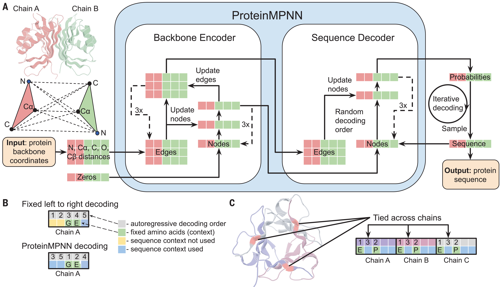

# Robust deep learning–based protein sequence design using ProteinMPNN

Dauparas et al., Science 378, 49–56 (2022) [Robust deep learning–based protein sequence design using ProteinMPNN | Science](https://www.science.org/doi/10.1126/science.add2187)

### 1. Computational experimental design (Model development & In silico testing)

**Fig. 1. ProteinMPNN architecture.**
(A) Distances between N, Cα, C, O, and virtual Cβ are encoded and processed using a message-passing neural network (MPNN) (Encoder) to obtain graph node and edge features. The encoded features, together with a partial sequence, are used to generate amino acids iteratively in a random decoding order. (B) A fixed left-to-right decoding cannot use sequence context (green) for preceding positions (yellow), whereas a model trained with random decoding orders can be used with an arbitrary decoding order during the inference. The decoding order can be chosen such that the fixed context is decoded first. (C) Residue positions within and between chains can be tied together, enabling symmetric, repeat protein, and multistate design. In this example, a homotrimer is designed with the coupling of positions in different chains. Predicted unnormalized probabilities for tied positions are averaged to get a single probability distribution from which amino acids are sampled.

> ##### 1. What is MPNN?
> 
> A **Message Passing Neural Network (MPNN)** is a graph neural network (GNN) tailored for graph-structured data. In protein sequence design, it models proteins as graphs—with nodes representing amino acid residues/atoms and edges encoding spatial/chemical relationships (e.g., distances, interactions). Its core is "message passing," where nodes iteratively exchange information to update states, capturing both local and global structural dependencies.
> 
> ##### 2. How MPNNs Outperform Other Methods
> 
> - **Explicit structural graphing**: Directly encodes atomic interactions/geometric features (e.g., Cα–Cα distances), achieving higher sequence recovery rates.
> - **Long-range dependency capture**: Uses message passing to model both local (e.g., secondary structure) and global (e.g., domain interactions) relationships, avoiding reliance on positional encodings (critical for multi-chain proteins).
> - **Non-protein component integration**: Builds protein-ligand/metal interaction graphs (e.g., LigandMPNN), boosting sequence recovery in binding regions and optimizing binding interfaces.
> - **Scalability & efficiency**: Generates sequences far faster by skipping intensive steps like Monte Carlo sampling, and generalizes well via large PDB dataset training.

#### 1.1 Training Data & Model Optimization

- **Training Dataset**: 19,700 high-resolution single-chain structures from the Protein Data Bank (PDB, X-ray/cryo-EM, resolution <3.5 Å, <10,000 residues), split into train/validation/test sets (80/10/10) using the CATH protein classification system.
  
  > The **CATH system** (short for *Class, Architecture, Topology, Homology*) is a widely used, hierarchical database and classification framework for organizing protein structures based on their structural and evolutionary relationships. It plays a critical role in structural biology by systematically categorizing proteins from the Protein Data Bank (PDB)—the global repository of experimentally determined protein structures—enabling researchers to study protein evolution, function, and design.

- **Model Optimization Experiments** (summarized in Table 1):
  
  1. **Input Feature Enhancement**: Added interatomic distances (N, Cα, C, O, and virtual Cβ) to replace/reinforce dihedral angles, increasing sequence recovery from 41.2% (baseline) to 49.0%.
  
  2. **Encoder Edge Updates**: Modified the message-passing neural network (MPNN) to update both node and edge features, improving recovery to 43.1%.
  
  3. **Combined Optimization**: Merging feature enhancement and edge updates raised recovery to 50.5%.
  
  4. **Random Decoding**: Replaced fixed N→C terminal decoding with random permutations, enabling flexible design (e.g., fixed functional motifs) and boosting recovery to 50.8%.
     
     > ##### Random Decoding v.s. Sequential Decoding:
     > 
     > **Sequential Decoding**
     > 
     > - **Traditional protein sequence design models** (including early deep learning-based methods and physically based approaches like Rosetta) rely on a **fixed decoding order from the N-terminus to the C-terminus** similar to the mechanism of natural proteins folding as they are synthesized and folded. 
     > - It creates a strict "causal chain" where later residues cannot influence earlier ones. As a result, it can not use "later" fixed residues (in the functional motifs) as context for designing "earlier" positions, and it performs poorly in predicint potential long-range interactions and interactions with C-terminal residues.
     > 
     > **Random Decoding**
     > 
     > - **Random Decoding** uses an **order-agnostic, variable sequence** of decoding. The order of residue selection is randomly sampled from all possible permutations, allowing any residue to be designed using context from *any other already decoded residues* (regardless of their position in the N/C terminal axis).
     > - Skips **fixed regions (usually functional regions)** and uses them as context for designing the rest, ensuring integration with pre-determined functional segments.
     > - **Reduced interpretability of design logic**: ProteinMPNN lack the "physical transparency" of physically based approaches (e.g., Rosetta), which optimize sequences via explicit energy functions. Random decoding exacerbates this interpretability challenge: in fixed N-to-C decoding, the design of each residue can be traced to its N-terminal context (a clear, linear causal chain), but random decoding’s variable context (residues are decoded in arbitrary orders) makes it difficult to pinpoint *why* a specific amino acid was chosen for a position.

- **Robustness Training**: Trained models with Gaussian noise (SD=0.02 Å) added to backbones to reduce overfitting to crystallographic details. This improved sequence recovery for AlphaFold-generated backbones (average IDDT >80) while slightly lowering recovery for unperturbed PDB structures.
  
  > ##### Mitigating Structural Uncertainty
  > 
  > **Why Gaussian Noise Is Added in ProteinMPNN**
  > 
  > - **Mitigate Overfitting to Crystallographic Details**: High-resolution structures (used for training) often contain subtle backbone features that are artifacts of structural refinement, not true determinants of amino acid identity. Adding noise blurs these minor artifacts, forcing the model to focus on **global topological features** (e.g., overall polar-nonpolar patterns, core-surface segregation) that are more critical for stable protein folding.
  > 
  > - **Improve Generalization to Real-World Structures**In practice, protein designers rarely work with perfect backbones. Natural proteins sample multiple conformations in solution, not just a single static structure.
  > 
  > **Alternative conformation sampling (common in physically based methods like Rosetta)**
  > 
  > - While both Gaussian noise and alternative conformation sampling address structural uncertainty, they are **complementary rather than equivalent**.
  > 
  > - Generates a diverse set of alternative backbone conformations **during the design process** (e.g., via "backrub" motions, molecular dynamics, or Monte Carlo sampling). These are distinct, plausible structural states of the protein. Ensures the designed sequence is stable across **multiple plausible conformations** of the backbone.
  > 
  > - **Includes larger, biologically relevant variations** (e.g., side-chain rotations, loop movements, or domain shifts) that the protein might sample in solution. While Gaussian Noise implementation is limited to small perturbations (Å-scale) around the original backbone, which focuses on "noise" rather than large-scale structural rearrangements.

####  1.2 In Silico Performance Evaluation

- **Benchmark vs. Rosetta**: For 402 monomer backbones, ProteinMPNN achieved 52.4% native sequence recovery (vs. 32.9% for Rosetta) and was 200x faster (1.2 vs. 258.8 seconds per 100 residues on a single CPU).
- **Generalization Testing**: Evaluated on 690 monomers, 732 homomers, and 98 heteromers:
  - Median sequence recovery: 52% (monomers), 55% (homomers), 51% (heteromers); interface recovery: 53% (homomers), 51% (heteromers).
  - Recovery correlated with residue burial (90–95% in deep cores, 35% on surfaces), reflecting reliance on local geometric context.
- **Sequence Diversity & Quality Control**: Adjusted sampling temperature to balance diversity and recovery (higher temperature increased diversity with minimal recovery loss) and used averaged log probability of sequences to rank design quality.

### 2. Experimental Evaluation of ProteinMPNN

The experimental evaluation of ProteinMPNN focused on rescuing previously failed designs (from Rosetta or AlphaFold) across diverse protein design scenarios—monomers, cyclic oligomers, tetrahedral nanoparticles, and functional binders—with validation via biochemical, biophysical, and structural techniques (x-ray crystallography, cryo-electron microscopy [cryo-EM], size exclusion chromatography [SEC], SEC-multiangle light scattering [SEC-MALS], and biolayer interferometry). Key findings are summarized below:

#### 2.1 Rescuing AlphaFold-Hallucinated Monomers and Homo-Oligomers

AlphaFold generates "hallucinated" protein backbones (via Monte Carlo optimization of structure predictability) but produces mostly insoluble sequences. ProteinMPNN redesigned sequences for a subset of these backbones (tying symmetry-equivalent residues) and tested expression in *E. coli*:

- **Solubility and yield**: Of 96 designs, 73 were soluble (vs. minimal solubility for AlphaFold’s original sequences), with a median soluble yield of 247 mg per liter of culture (vs. 9 mg for AlphaFold’s sequences).
- **Thermostability**: Many designs retained secondary structure up to 95°C (confirmed via circular dichroism).
- **Structural validation**: X-ray crystallography of one monomer design (α-β fold, TM-score = 0.56 vs. PDB) showed it matched the target backbone (2.35 Å RMSD over 130 residues), with AlphaFold-predicted side chains fitting electron density. Additionally, 10 cyclic homooligomers (130–1800 residues) had cryo-EM/x-ray structures nearly identical to design models.

#### 2.2 Rescuing Repeat Proteins and Enforcing Symmetry

ProteinMPNN leveraged flexible decoding to "tie" residues at equivalent positions in repeat proteins (addressing suboptimal Rosetta designs):

- For a Rosetta-designed repeat protein with a perfectly repeating structural unit, tying corresponding residues during ProteinMPNN decoding produced sequences that folded to the target backbone (~1.2 Å RMSD over 232 residues, confirmed via AlphaFold).
- For enforcing both cyclic (*C₅/C₆*) and internal repeat symmetry: 16/18 ProteinMPNN designs were soluble (vs. 4/10 Rosetta designs), and 5 had the correct oligomeric state (validated via SEC-MALS). Negative-stain EM of one large cyclic oligomer showed class averages matching the design model.

#### 2.3 Designing Tetrahedral Protein Nanoparticles

ProteinMPNN redesigned sequences for 27 previously failed two-component tetrahedral nanoparticle backbones (Rosetta required >1 week of manual optimization to reduce hydrophobicity and improve packing):

- **Automated success**: 13/76 ProteinMPNN designs formed assemblies of the expected molecular weight (~1 MDa, via SEC) without manual intervention.
- **Structural accuracy**: X-ray crystallography of one nanoparticle showed it matched the design model (1.2 Å Cα RMSD over two subunits), validating robust assembly.

#### 2.4 Rescuing Functional Protein Binders (SH3 Domain Scaffolds)

To test functional design, ProteinMPNN targeted proteins scaffolding a proline-rich SH3-binding motif (PPPRPPK) recognized by the Grb2 SH3 domain (Rosetta designs failed to bind):

- ProteinMPNN fixed the core PPPRPPK motif and redesigned the surrounding scaffold.
- **Binding validation**: Biolayer interferometry showed strong binding of ProteinMPNN designs to Grb2 SH3 (higher signal than the free peptide), while point mutations (N→D) disrupting scaffolding eliminated binding.
